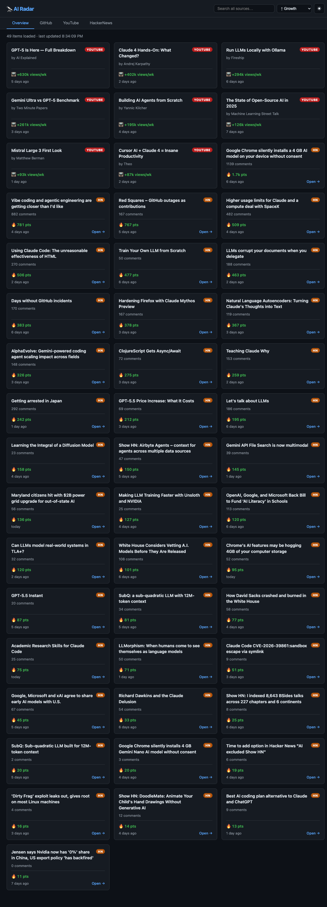
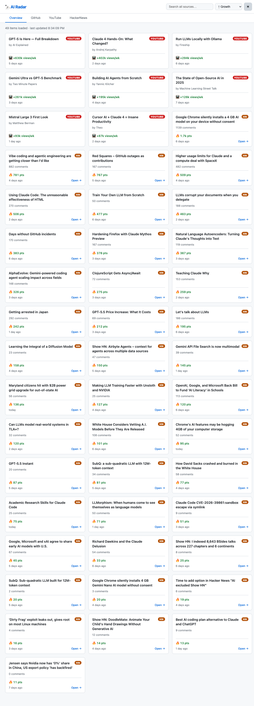
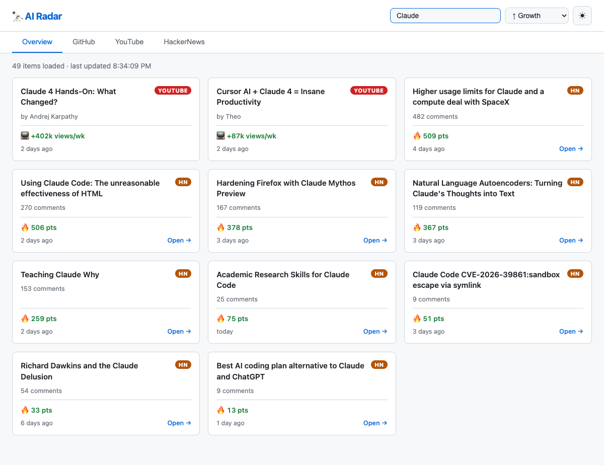
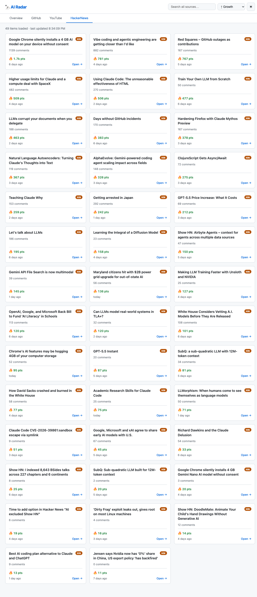
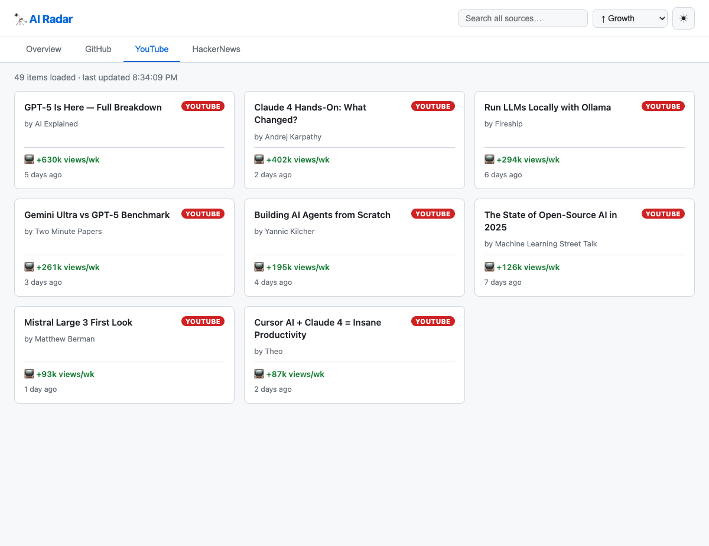
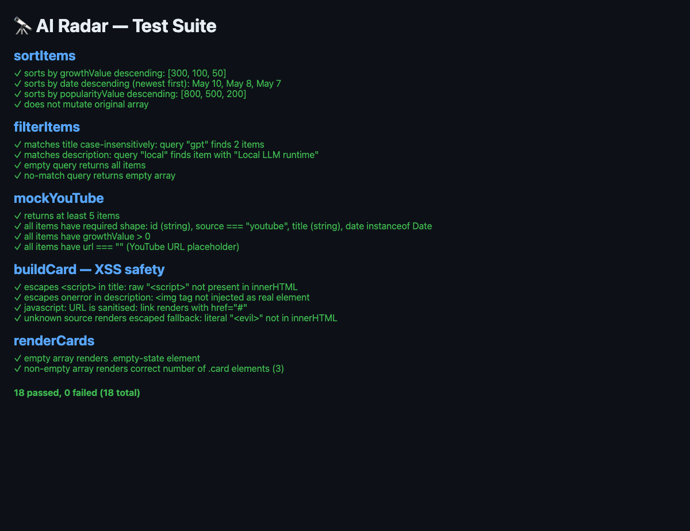

# 🔭 AI Trends Dashboard

A single-page dashboard that tracks what's trending in AI right now — pulling live data from GitHub and HackerNews, updated every time you open it.



---

## Features

- **3 live sources** — GitHub trending AI/ML repos, HackerNews top AI stories, mock YouTube videos (real API key optional)
- **4 tabs** — Overview (all sources combined), GitHub, YouTube, HackerNews
- **Search** — filter across all sources simultaneously; clears automatically on tab switch
- **Sort** — by growth rate, date, or popularity
- **Dark / light theme** — toggle with one click
- **No build step** — open `index.html` directly in any modern browser

---

## Screenshots

### Dark mode — Overview


### Light mode — Overview



### Search — filtering by keyword



### HackerNews tab — live stories



### YouTube tab — trending AI videos



### Test suite — 18/18 passing



---

## Quick start

```bash
# Clone
git clone https://github.com/ZeekrBaha/ai-trends-dashboard.git
cd ai-trends-dashboard

# Open directly (works in most browsers)
open index.html

# Or serve over HTTP (required for some browsers)
python3 -m http.server 8080
# then open http://localhost:8080
```

## Run tests

```bash
open test.html
# or serve and open http://localhost:8080/test.html
```

All 18 tests run in the browser. Results are shown inline with colour-coded pass/fail output.

---

## Data sources

| Source | API | Auth required | What it shows |
|---|---|---|---|
| **GitHub** | [GitHub Search API](https://docs.github.com/en/rest/search) | No (rate-limited) | AI/ML repos created in the last 7 days, sorted by stars |
| **HackerNews** | [Algolia HN API](https://hn.algolia.com/api) | No | Top AI stories by points from the last 7 days |
| **YouTube** | Mock data | — | 8 placeholder videos (see below to wire up real data) |

> **GitHub rate limits:** The unauthenticated GitHub Search API allows 10 requests/hour. If the GitHub tab shows no results, you've hit the limit. Add a `GITHUB_TOKEN` to lift it (see below).

---

## Add a GitHub token (optional)

To avoid rate limiting on GitHub:

1. Generate a token at [github.com/settings/tokens](https://github.com/settings/tokens) (no scopes needed for public repos)
2. In `data.js`, add the header to `fetchGitHub()`:

```js
{ headers: { Accept: 'application/vnd.github+json', Authorization: 'Bearer YOUR_TOKEN' } }
```

---

## Add real YouTube data (optional)

YouTube currently shows mock data. To wire up live results:

1. Get a key from [Google Cloud Console → YouTube Data API v3](https://console.cloud.google.com/)
2. In `data.js`, replace `mockYouTube()` with:

```js
export async function fetchYouTube(apiKey) {
  const since = new Date(Date.now() - 7 * 24 * 60 * 60 * 1000).toISOString();
  const res = await fetch(
    `https://www.googleapis.com/youtube/v3/search?part=snippet&q=artificial+intelligence&type=video&order=viewCount&publishedAfter=${since}&maxResults=20&key=${apiKey}`
  );
  if (!res.ok) throw new Error(`YouTube API ${res.status}`);
  const data = await res.json();
  return data.items.map(v => ({
    id: `yt-${v.id.videoId}`,
    source: 'youtube',
    title: v.snippet.title,
    description: `by ${v.snippet.channelTitle}`,
    url: `https://www.youtube.com/watch?v=${v.id.videoId}`,
    growthValue: 0,
    growthLabel: '📺 trending',
    popularityValue: 0,
    date: new Date(v.snippet.publishedAt),
  }));
}
```

3. In `app.js`, call `fetchYouTube(YOUR_KEY)` alongside the other fetches in `init()`.

---

## File structure

```
ai-trends-dashboard/
├── index.html          # App shell — header, tabs, search, sort, card grid
├── style.css           # Dark/light themes via CSS custom properties
├── app.js              # State management and event wiring
├── data.js             # Fetch functions and data transformations
├── ui.js               # XSS-safe card renderer
├── test.html           # Browser test runner
├── test.js             # 18 unit tests (no framework)
└── docs/
    └── screenshots/    # README screenshots
```

---

## Tech stack

- **HTML + CSS + vanilla JS** — no framework, no build step
- **ES modules** — `import`/`export` throughout
- **CSS custom properties** — dark/light theme switching with zero JS
- **`Promise.allSettled`** — one source failing never breaks the rest
